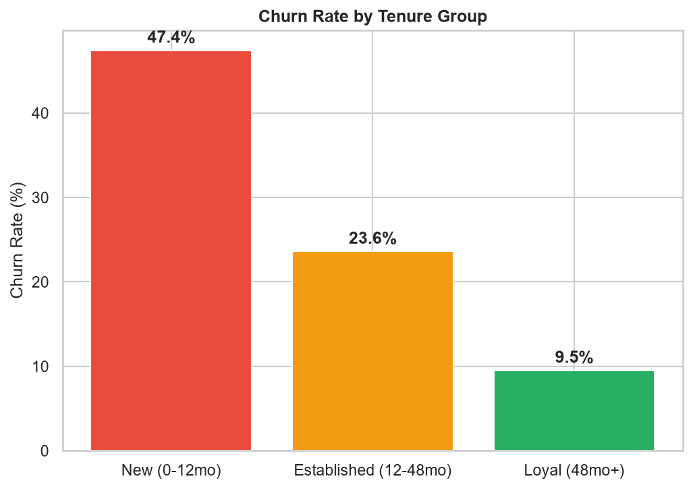
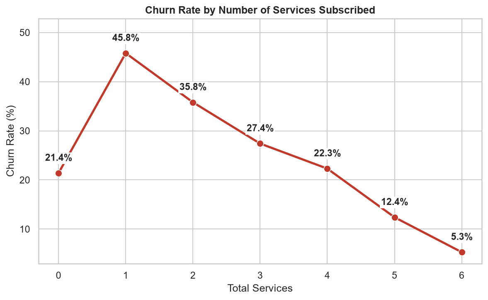

# Telco Customer Churn Analysis

Are early-tenure customers quietly costing this company the most?

A telecom company loses customers every month, but not all lost customers cost the business the same. Is churn really concentrated in new sign-ups, or is it spread evenly across the whole customer base? And does bundling more services actually make a customer safer to keep?

This project analyzes the Telco Customer Churn dataset using Python and Pandas, engineering new features from the raw data, to identify which customer segments drive churn and to uncover customers who look safe on paper but are not.

## Dataset

[Telco Customer Churn Dataset](https://www.kaggle.com/datasets/blastchar/telco-customer-churn) from Kaggle.

The dataset contains 7,043 customer records from a telecom company, including:

* Tenure (months as a customer)
* Contract type
* Monthly and total charges
* Six add-on services (security, backup, device protection, tech support, streaming TV/movies)
* Churn status

## Tools

* Python
* Pandas
* Matplotlib
* Seaborn
* SciPy

## Key Findings

### 1. Churn Is Heavily Front-Loaded

New customers (0–12 months) churn at 47.4%, nearly five times the rate of loyal customers (48+ months) at 9.5%. Established customers (12–48 months) sit in between at 23.6%. This gap is statistically significant (chi-square p < 0.001).

### 2. More Services Generally Means Safer, With One Exception

Churn drops steadily from 45.8% down to 5.3% as customers subscribe to more of the six add-on services. The exception: customers with exactly one service churn worse (45.8%) than customers with zero services (21.4%), suggesting a single add-on signals a customer still testing the waters rather than committing.

### 3. A Hidden Risk Inside a "Safe-Looking" Segment

Looking at tenure and service count alone hides an important pattern. Customers on a month-to-month contract, with established tenure (12–48 months) and 4 subscribed services, still churn at approximately 45%, nearly double the overall churn rate.

This highlights an important business insight:

> Contract type can override tenure and service count as predictors of loyalty.

## Visualizations

### Churn Rate by Tenure Group

New customers churn at nearly five times the rate of loyal, long-tenured customers.



### Churn Rate by Number of Services Subscribed

Churn generally falls as service count rises, apart from an unexpected spike at exactly one service.



## Business Recommendations

### 1. Front-Load Retention Into the First 12 Months

New customers churn at roughly double the base rate. A structured onboarding or check-in program in the first few months has the highest leverage of any intervention in this data.

### 2. Treat the First Add-on Service as a Conversion Moment

Customers with only one service churn worse than customers with none. Sales and support teams should aim to land customers on a 2–3 service bundle from the start, or follow up quickly with a second offer.

### 3. Target Month-to-Month Contracts for Conversion

Established, well-serviced customers on month-to-month contracts still churn at ~45%. A conversion incentive aimed at this specific segment addresses the highest-value blind spot in the data, not the newest customers, but the ones retention programs typically assume are already safe.

## Conclusion

Churn at this company is not random. It is concentrated and predictable. New customers churn at nearly five times the rate of loyal customers, and service bundling helps only after the first add-on. The most valuable finding is the segment retention teams would normally overlook: established, well-serviced customers on month-to-month contracts still churn at ~45%, showing that contract type, not tenure or service count, is the real driver of loyalty.

For better retention decisions, tenure and service count should be evaluated together with contract type rather than relying on either signal alone.

## Project Structure

```text
telco-customer-churn-analysis/
│
├── README.md
├── requirements.txt
├── LICENSE
│
├── data/
│   └── WA_Fn-UseC_-Telco-Customer-Churn.csv
│
├── notebooks/
│   └── analysis.ipynb
│
└── reports/
    └── figures/
        ├── chart1_churn_by_tenure.png
        └── chart2_churn_by_services.png
```

## How to Run

### 1. Clone the Repository

```bash
git clone https://github.com/Coding-With-Subin/telco-customer-churn-analysis.git
cd telco-customer-churn-analysis
```

### 2. Install Dependencies

```bash
pip install -r requirements.txt
```

### 3. Dataset

Download the [Telco Customer Churn Dataset](https://www.kaggle.com/datasets/blastchar/telco-customer-churn) from Kaggle.

Place the CSV file in:

```text
data/WA_Fn-UseC_-Telco-Customer-Churn.csv
```

### 4. Run the Analysis

Open the notebook:

```text
notebooks/analysis.ipynb
```

Run the notebook cells to reproduce the analysis and visualizations.

## License

This project is licensed under the MIT License. See the LICENSE file for details.

The MIT License applies to the code and project materials in this repository. The Telco Customer Churn dataset is sourced from Kaggle and remains subject to its original licensing and usage terms.

## Key Takeaway

**Tenure and service count tell you who's been around. Contract type tells you who's actually staying.**

This project demonstrates how feature engineering and exploratory data analysis can turn raw customer records into practical retention strategy.

*Part of the Coding with Subin project series.*
